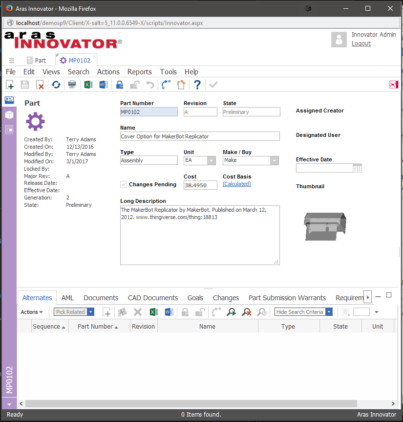

# Hide Tabs on an Aras Form

This project demonstrates how to hide specific tabs on a tear-off form. For this sample code, we hide the BOM and BOM Structure tabs on the OOTB Aras Part form.

## Project Details

See [TESTSTATUS file](./TESTSTATUS.md) for latest testing information.

#### Browsers Tested:
Internet Explorer 11, Firefox 63, Chrome69

## Release History

Release | Aras Versions | Notes
--------|--------|--------
[v2.0.1](https://github.com/ArasLabs/hide-tabs/releases/tag/v2.0.1 ) | 11 SP12 |readme.md file updated for the Aras 11 SP12 and  updated test status.
[v2.0.1](https://github.com/ArasLabs/hide-tabs/releases/tag/v2.0.1) | 11 SP9 | Fixed release links in project readme and updated test status.
[v2.0](https://github.com/ArasLabs/hide-tabs/releases/tag/v2.0) | 11 SP9 | Project updated for the Aras 11 SP9 tabbed client.
[v1.0](https://github.com/ArasLabs/hide-tabs/releases/tag/v1.0) | 11 SP7, 11 SP5 | Initial release based on a legacy community project.

## Installation

#### Important!
**Always back up your code tree and database before applying an import package or code tree patch!**

### Pre-requisites

1. Aras Innovator installed (version 11.0 SPx preferred)
2. Aras Package Import tool
3. labs_HideTabs import package

### Install Steps

1. Backup your database and store the BAK file in a safe place.
2. Open up the Aras Package Import tool.
3. Enter your login credentials and click **Login**
    * _Note: You must login as root for the package import to succeed!_
4. Enter the package name in the TargetRelease field.
    * Optional: Enter a description in the Description field.
5. Enter the path to your local `..\HideTabs\Import\imports.mf` file in the Manifest File field.
6. Select **aras.labs.HideTabs** in the Available for Import field.
7. Select Type = **Merge** and Mode = **Thorough Mode**.
8. Click **Import** in the top left corner.
9. Close the Aras Package Import tool.

## Usage

1. Log in to Aras as a user with permission to view Parts - i.e. 'admin'.
2. Select **Design > Parts** in the Table of Contents (TOC).
3. Open up any Part item for viewing.

The BOM and BOM Structure tabs will be hidden from the form. The first relationship tab that appears will be the 'Alternates' tab.

## Contributing

1. Fork it!
2. Create your feature branch: `git checkout -b my-new-feature`
3. Commit your changes: `git commit -am 'Add some feature'`
4. Push to the branch: `git push origin my-new-feature`
5. Submit a pull request

For more information on contributing to this project, another Aras Labs project, or any Aras Community project, shoot us an email at araslabs@aras.com.

## Credits

Original code written by Aras Support.

Documented and published by Eli Donahue for Aras Labs. @EliJDonahue

## License

Aras Labs projects are published to Github under the MIT license. See the [LICENSE file](./LICENSE.md) for license rights and limitations.
